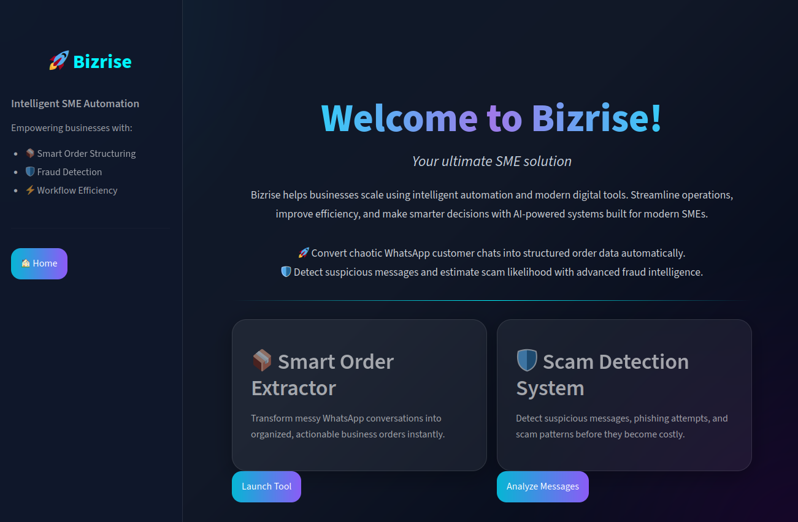

# BizRise 🚀

BizRise is an AI-powered business assistant designed to help SMEs automate repetitive operational tasks like extracting customer orders from WhatsApp chats and detecting potentially fraudulent messages.

The project combines a modern Streamlit interface with LLM-powered analysis to turn messy conversations into structured business data that teams can actually use.

---

## Features

### 📦 Smart Order Extraction

Convert unstructured WhatsApp conversations into clean, structured order details.

The system can extract:

* Customer name
* Ordered items
* Quantities
* Delivery information
* Payment status
* Priority level
* Special instructions

---

### 🛡️ Fraud Shield AI

Analyze suspicious-looking messages and estimate fraud risk.

The fraud analyzer identifies:

* Scam patterns
* Suspicious urgency
* Phishing attempts
* Manipulative language
* Risk level
* Confidence score
* Recommended actions

---

### 📧 Automated Email Forwarding

Structured orders can be sent directly to an operations or fulfillment team via email.

---

### 🎨 Modern Dashboard UI

Built with Streamlit and custom CSS for a clean glassmorphism-inspired interface.

---

# Tech Stack

## Frontend

* Python
* Streamlit
* Plotly

## AI / LLM

* Groq API
* `openai/gpt-oss-120b`

## Backend Utilities

* SMTP Email
* JSON Processing
* Environment Variables (`python-dotenv`)

---

# Project Structure

```text id="dqmjlwm"
BizRise/
│
├── app.py                  # Main Streamlit application
├── prompt.txt              # Order extraction prompt
├── prompt2.txt             # Fraud analysis prompt
├── email.txt               # HTML email template
├── .env                    # Environment variables
├── requirements.txt
│
└── assets/                 # Optional static assets
```

---

# Installation

## 1. Clone the repository

```bash id="o6u0h5"
git clone https://github.com/Manuel-7tin/BizRise.git
cd BizRise
```

---

## 2. Create a virtual environment

### Linux / Mac

```bash id="r8r4ij"
python -m venv venv
source venv/bin/activate
```

### Windows

```bash id="lqgk2n"
python -m venv venv
venv\Scripts\activate
```

---

## 3. Install dependencies

```bash id="jlwm8r"
pip install -r requirements.txt
```

---

## 4. Configure environment variables

Create a `.env` file:

```env id="3cr2o4"
PWORD=your_email_app_password
GROQ_API_KEY=your_groq_api_key
```

---

## 5. Run the application

```bash id="4qsdx0"
streamlit run app.py
```

---

# Example Use Cases

## Order Extraction

### Input

```text id="jlwmhf"
Customer: Hi Chioma here, I need 3 bags of rice and 2 cartons of noodles.
Customer: Please deliver tomorrow morning to Lekki.
Customer: Payment has already been made.
```

### Output

```json id="2az7ko"
[
  {
    "customer_name": "Chioma",
    "order_items": [
      {
        "item": "Rice",
        "quantity": 3
      },
      {
        "item": "Noodles",
        "quantity": 2
      }
    ],
    "details_left": {
      "delivery_date": "2026-05-24",
      "payment_status": "Paid",
      "priority_level": "Medium"
    },
    "details_right": {
      "customer_phone": null,
      "delivery_location": "Lekki",
      "special_instructions": null
    }
  }
]
```
---

## Fraud Detection

### Input

```text id="mjlwm1"
URGENT: Your account has been suspended.
Click this link immediately to avoid permanent restriction.
```

### Output

```json id="jlwmk8"
{
  "risk_level": "Scam Likely",
  "scam_type": "Phishing",
  "red_flags": [
    "urgent pressure tactics",
    "threat of account suspension",
    "request to click a link",
    "impersonation of service provider"
  ],
  "explanation": "The message uses urgent language and threatens account suspension to force the recipient to click a link, a common phishing tactic.",
  "recommended_action": "Do not click links",
  "confidence_score": 92
}
```

---

# Current Limitations

* Prompt-based extraction can occasionally return malformed JSON
* No persistent database yet
* No authentication system
* Fraud analysis relies entirely on LLM inference
* Email sending currently uses SMTP credentials directly

---

# Future Improvements

Some planned upgrades include:

* WhatsApp API integration
* Database storage for orders and fraud logs
* Inventory management integration
* Role-based authentication
* Better structured output handling with Pydantic
* Agentic workflow orchestration
* Real-time notifications
* Customer memory/history tracking

---

# Why BizRise?

Many small businesses handle orders manually through WhatsApp chats, which quickly becomes difficult to manage at scale.

BizRise was built to reduce that operational friction by helping teams:

* process customer orders faster
* reduce human error
* identify suspicious activity early
* automate repetitive workflows

---

# Screenshots

Add screenshots here once available.

Example:

```md id="jlwm9d"

```

---

# Contributing

Contributions, suggestions, and improvements are welcome.

To contribute:

```bash id="sdjlwm"
git checkout -b feature-name
git commit -m "Added feature"
git push origin feature-name
```

Then open a pull request.

---

# License

This project is licensed under the MIT License.

---

# Author

Built by Manuel.

